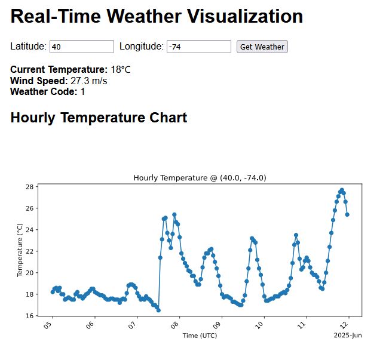
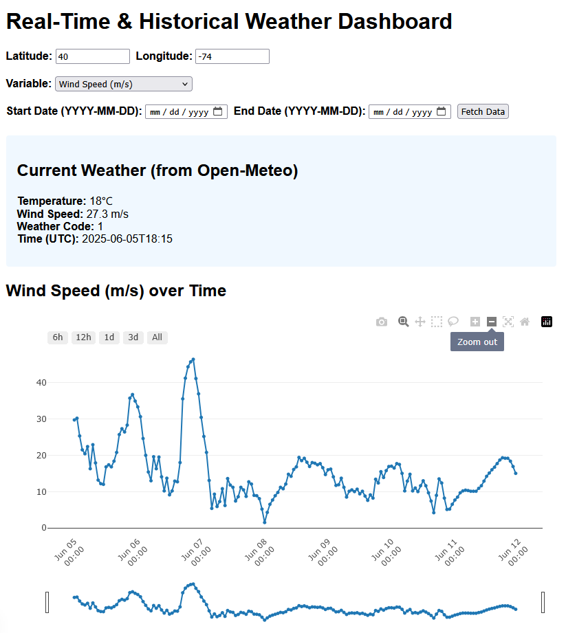

Some Next.js practice including API routing, dynamic rendering, and separation of concerns.
It fetches real-time weather data from the Open-Meteo API and dynamically renders a chart in two ways:
The first way is by making a call to the python backend to fetch data and create a matplotlib SVG. This is better for charting data from a backend such as a database, or if the data requires heavy preprocessing, or custom drawing/scientific plotting.

The second way is using react-plotly to directly generate the chart on the page. This is easier in this application because plotly has built-in zoom and is trivial to hook into, and we can get raw JSON from the weather api. This provides us with client-side interactability easily.

